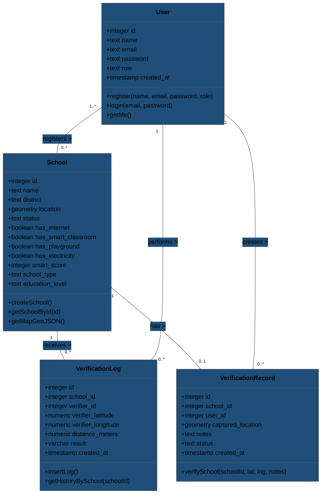
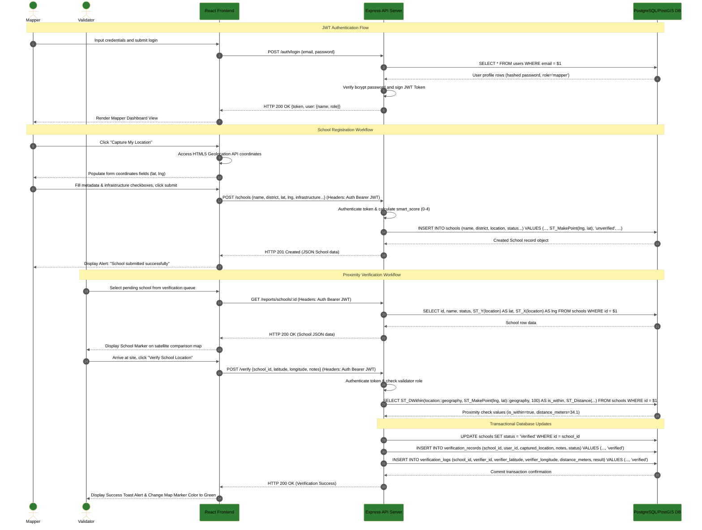
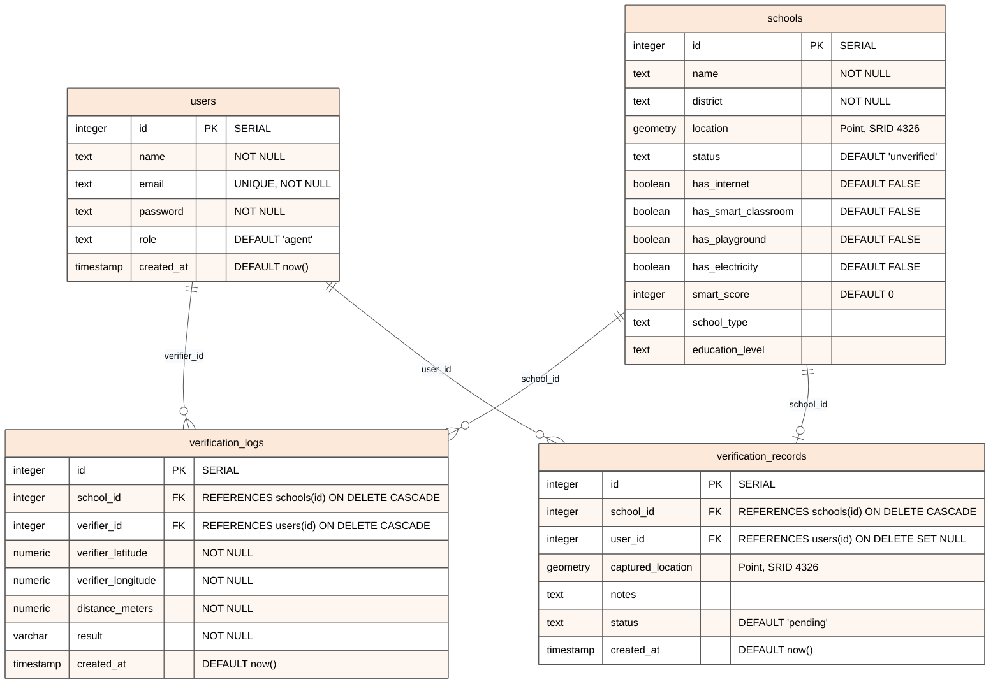

# CHAPTER 3: REQUIREMENTS ANALYSIS AND SYSTEM DESIGN

This document contains the requirements analysis and architectural design for the **Smart School Existence Verification and Mapping System (SSEVMS)**. The diagrams and specifications contained herein reflect the actual implemented system, which consists of a single-page application frontend built on React, TypeScript, and Tailwind CSS, an API server implemented in Node.js and Express, and a relational database managed in PostgreSQL with the PostGIS spatial extension.

---

## 3.1 USE CASE DIAGRAM

The Use Case Diagram illustrates the functional requirements of the SSEVMS by identifying the interactions between the system actors and the core use cases. The system contains three distinct actors:
*   **Administrator**: Responsible for high-level monitoring, generating system-wide analytical reports, checking audit trails, and inspecting school entries.
*   **Mapper**: A field officer responsible for registering new schools, capturing spatial GPS coordinates, assessing infrastructure metrics, and submitting school profiles.
*   **Validator**: An officer responsible for inspecting submissions, verifying spatial proximity via GPS, and approving or rejecting school existence.

### Figure 3.1: SSEVMS Use Case Diagram

```mermaid
%%{init: {'theme': 'base', 'themeVariables': { 'primaryColor': '#D9EAF7', 'primaryTextColor': '#000000', 'primaryBorderColor': '#555555', 'lineColor': '#555555' }}}%%
flowchart TB
    %% Class Definitions for Theme Coloring
    classDef actorNode fill:#2E7D32,stroke:#555555,stroke-width:1.5px,color:#000000;
    classDef processNode fill:#D9EAF7,stroke:#555555,stroke-width:1.5px,color:#000000;

    %% Actors
    Admin((Administrator)):::actorNode
    Mapper((Mapper)):::actorNode
    Validator((Validator)):::actorNode

    %% Boundary
    subgraph SystemBoundary ["SSEVMS System Boundary"]
        %% Shared Use Cases
        UC_Login(["Login"]):::processNode
        UC_ViewMap(["View Map"]):::processNode
        UC_SearchSchools(["Search Schools"]):::processNode

        %% Admin Use Cases
        UC_ManageUsers(["Manage Users"]):::processNode
        UC_ViewAnalytics(["View Analytics"]):::processNode
        UC_GenReports(["Generate Reports"]):::processNode
        UC_ViewAuditLogs(["View Audit Logs"]):::processNode
        UC_MonitorVerification(["Monitor Verification Activities"]):::processNode

        %% Mapper Use Cases
        UC_RegisterSchool(["Register School"]):::processNode
        UC_CaptureGPS(["Capture GPS Coordinates"]):::processNode
        UC_RecordSchoolInfo(["Record School Information"]):::processNode
        UC_RecordInfrastructure(["Record Infrastructure Indicators"]):::processNode
        UC_SubmitSchool(["Submit School Data"]):::processNode

        %% Validator Use Cases
        UC_ReviewSubmitted(["Review Submitted Schools"]):::processNode
        UC_VerifyExistence(["Verify School Existence"]):::processNode
        UC_ApproveSchool(["Approve School"]):::processNode
        UC_RejectSchool(["Reject School"]):::processNode
        UC_ViewVerificationHistory(["View Verification History"]):::processNode
    end

    %% Administrator Associations
    Admin --- UC_Login
    Admin --- UC_ManageUsers
    Admin --- UC_ViewAnalytics
    Admin --- UC_GenReports
    Admin --- UC_ViewAuditLogs
    Admin --- UC_MonitorVerification
    Admin --- UC_ViewMap
    Admin --- UC_SearchSchools

    %% Mapper Associations
    Mapper --- UC_Login
    Mapper --- UC_RegisterSchool
    Mapper --- UC_CaptureGPS
    Mapper --- UC_RecordSchoolInfo
    Mapper --- UC_RecordInfrastructure
    Mapper --- UC_SubmitSchool
    Mapper --- UC_ViewMap
    Mapper --- UC_SearchSchools

    %% Validator Associations
    Validator --- UC_Login
    Validator --- UC_ReviewSubmitted
    Validator --- UC_VerifyExistence
    Validator --- UC_ApproveSchool
    Validator --- UC_RejectSchool
    Validator --- UC_ViewVerificationHistory
    Validator --- UC_ViewMap
    Validator --- UC_SearchSchools

    %% Dependencies & Includes
    UC_RegisterSchool -.->|"<<include>>"| UC_CaptureGPS
    UC_RegisterSchool -.->|"<<include>>"| UC_RecordSchoolInfo
    UC_RegisterSchool -.->|"<<include>>"| UC_RecordInfrastructure
    UC_SubmitSchool -.->|"<<include>>"| UC_RegisterSchool

    UC_VerifyExistence -.->|"<<include>>"| UC_ReviewSubmitted
    UC_ApproveSchool -.->|"<<include>>"| UC_VerifyExistence
    UC_RejectSchool -.->|"<<include>>"| UC_VerifyExistence

    %% Style system boundary
    style SystemBoundary fill:#FAFAFA,stroke:#808080,stroke-width:2.5px,color:#000000
    linkStyle default stroke:#555555,stroke-width:1.5px;
```



*Figure 3.1: SSEVMS Use Case Diagram.*

### Use Case Description
The SSEVMS Use Case Diagram defines the functional scope of the platform. The system operates under a strict role-based access control (RBAC) model. All actors must execute the `Login` use case to access secure functions. Once authenticated, the user’s role determines which actions are available. The `View Map` and `Search Schools` use cases represent core shared utilities that allow mappers, validators, and administrators to locate and check schools using Leaflet spatial layers.

For the Mapper, the primary workflow focuses on registering and submitting school profiles. The mapping process includes capturing live device GPS coordinates, entering basic details (name, district), and recording specific smart infrastructure indicators (internet, electricity, smart classrooms, and playgrounds) that determine the school's overall digital readiness score. For the Validator, the focus is on verification. They review submissions from a queue, compare GPS locations by pulling high-resolution Maxar satellite tiles, capture their own verification coordinates, and trigger a proximity validation check which automatically approves or rejects the entry.

The Administrator possesses a bird's-eye view of the system. The Administrator monitors school submissions, analyzes infrastructure distributions, views verification audit logs, and exports compiled PDF summaries. This structure guarantees that data capture is separated from verification, maintaining data integrity across the system.

---

## 3.2 CLASS DIAGRAM

The Class Diagram represents the structural model of the application. It maps the data entities, their internal properties (attributes), operations (methods), and the multiplicities defining their relationships. The four main classes correspond to the core database tables and API models: `User`, `School`, `VerificationLog`, and `VerificationRecord`.

### Figure 3.2: SSEVMS Class Diagram



*Figure 3.2: SSEVMS Class Diagram.*

### Class Diagram Description
The Class Diagram models the logical architecture of the SSEVMS. The `User` class represents authenticated operators (Administrators, Mappers, and Validators). Users interact with schools by registering them or performing validations. When a Mapper creates a `School` instance, the coordinates are processed as a spatial `geometry` type using the PostGIS extension, and infrastructure variables are recorded alongside a calculated `smart_score` (calculated as an integer from 0 to 4 based on internet, electricity, smart classroom, and playground availability).

The validation phase introduces the `VerificationRecord` and `VerificationLog` classes. A `VerificationRecord` stores the final validation outcome for a school (either "verified" or "pending"), along with validator notes and the physical coordinates where the verification was completed. The `VerificationLog` class acts as the historical log, tracking every individual verification attempt. It records the validator's precise latitude and longitude, the exact spatial distance calculated between the validator and the school, and the result ("verified" or "rejected").

Multiplicities ensure logical constraints: multiple `User` accounts can register multiple schools ($1..*$ to $0..*$). Each `School` corresponds to exactly one final `VerificationRecord` ($0..1$), reflecting its current verified status, but may accumulate multiple `VerificationLog` attempts ($0..*$) representing a complete audit trail of field verification efforts.

---

## 3.3 ACTIVITY DIAGRAM

The Activity Diagram models the operational workflow of school data collection, processing, validation, and publication. It details the step-by-step actions using swimlanes to partition responsibilities among the `Mapper`, the `System`, and the `Validator`.

### Figure 3.3: School Registration and Verification Activity Diagram

```mermaid
%%{init: {'theme': 'base', 'themeVariables': { 'primaryColor': '#D9EAF7', 'primaryTextColor': '#000000', 'primaryBorderColor': '#555555', 'lineColor': '#555555' }}}%%
flowchart TD
    classDef processNode fill:#D9EAF7,stroke:#555555,stroke-width:1.5px,color:#000000;
    classDef decisionNode fill:#FFF2CC,stroke:#555555,stroke-width:1.5px,color:#000000;

    subgraph Mapper ["Mapper Swimlane"]
        A([Start]):::processNode --> B[Login to SSEVMS App]:::processNode
        B --> C[Initialize School Registration Form]:::processNode
        C --> D[Capture GPS Coordinates via Geolocation API]:::processNode
        D --> E[Record School Type and Education Level]:::processNode
        E --> F[Select Infrastructure Indicators Checkboxes]:::processNode
        F --> G[Submit School Data Record]:::processNode
    end

    subgraph System ["System Swimlane"]
        G --> H[Validate Token and Payload Inputs]:::processNode
        H --> I[Calculate smart_score from Checked Indicators]:::processNode
        I --> J[Convert Coordinates to PostGIS Point Geometry]:::processNode
        J --> K[Insert School Record into Database as 'unverified']:::processNode
        K --> L[Publish Entry in Validator Verification Queue]:::processNode
    end

    subgraph Validator ["Validator Swimlane"]
        L --> M[Login & View Verification Queue]:::processNode
        M --> N[Select School & Inspect Metadata vs Satellite Imagery]:::processNode
        N --> O[Capture Current Coordinates at Verification Site]:::processNode
        O --> P[Submit Verification Request]:::processNode
    end

    subgraph ProximitySystem ["System (Proximity Verification)"]
        P --> Q[Fetch School Point Geometry from Database]:::processNode
        Q --> R{Execute Proximity Check:<br>ST_DWithin <= 100m?}:::decisionNode
        
        %% Rejection Path
        R -->|No| S[Insert Log: result='rejected']:::processNode
        S --> T[Return Distance Error Message]:::processNode
        T --> U[Display Proximity Alert UI]:::processNode
        U --> O

        %% Approval Path
        R -->|Yes| V[Update School Status to 'Verified']:::processNode
        V --> W[Insert Verification Record and Log]:::processNode
        W --> X[Return Proximity Approval Success]:::processNode
    end

    subgraph Publish ["System (Interactive Mapping)"]
        X --> Y[Refresh School Map Layer]:::processNode
        Y --> Z[Publish Verified Marker on Leaflet Interactive Map]:::processNode
        Z --> AA([End]):::processNode
    end

    %% Styles for Swimlanes
    style Mapper fill:#FAFAFA,stroke:#808080,stroke-width:2px,color:#000000
    style System fill:#FAFAFA,stroke:#808080,stroke-width:2px,color:#000000
    style Validator fill:#FAFAFA,stroke:#808080,stroke-width:2px,color:#000000
    style ProximitySystem fill:#FAFAFA,stroke:#808080,stroke-width:2px,color:#000000
    style Publish fill:#FAFAFA,stroke:#808080,stroke-width:2px,color:#000000

    linkStyle default stroke:#555555,stroke-width:1.5px;
```



*Figure 3.3: School Registration and Verification Activity Diagram.*

### Activity Diagram Description
The Activity Diagram outlines the verification pipeline of the SSEVMS. The process begins in the Mapper swimlane, where the field officer logs in and inputs school identity metadata. Using the browser's HTML5 Geolocation API, the mapper captures high-accuracy coordinates. The mapper then assesses the school's smart infrastructure, checking binary indicators for internet, electricity, smart classroom, and playground availability, and submits the data.

Once submitted, control transitions to the API Server. The server validates the request payload and calculates the `smart_score` as the sum of all checked infrastructure indicators. The coordinates are converted into a spatial geometry point using the PostGIS spatial engine (`ST_SetSRID(ST_MakePoint(), 4326)`) and stored in the database with an initial status of `'unverified'`. The school is then added to the validator's pending verification queue.

The Validator reviews the pending school, using satellite imagery to inspect building footprints. In the field, the validator captures their current GPS coordinates and submits a verification request. The API Server runs a spatial query using `ST_DWithin` to check if the validator's coordinates are within 100 meters of the school's registered location. If the validator is too far, the system records a `'rejected'` status in `verification_logs` and prompts the validator to re-capture. If the validator is within the threshold, the database updates the school status to `'Verified'` and inserts verification records. The map layer then refreshes to display the verified school marker.

---

## 3.4 SEQUENCE DIAGRAM

The Sequence Diagram details the dynamic interaction over time between the system participants during registration and spatial verification. The participants are: `Mapper` (Actor), `Validator` (Actor), `React Frontend` (Boundary UI), `Express API Server` (Controller), and the `PostgreSQL/PostGIS Database` (Entity).

### Figure 3.4: School Registration and Verification Sequence Diagram



*Figure 3.4: School Registration and Verification Sequence Diagram.*

### Sequence Diagram Description
The Sequence Diagram models the chronological flow of messages between system components. In Phase 1, the Mapper authenticates with the Express API Server. The server queries the database, compares password hashes using bcrypt, and issues a JWT token. The Mapper's frontend captures GPS coordinates through the browser's Geolocation API and submits the registration form. The API server computes the `smart_score` and writes the record to the database, converting the coordinates using PostGIS `ST_MakePoint` and storing it with an `'unverified'` status.

In Phase 2, the Validator logs in and requests the pending school profile. The frontend displays the school on a map and overlays high-resolution satellite imagery. The Validator then captures their current coordinates at the school site and submits them to the `/verify` endpoint. The API server executes a spatial query using PostGIS `ST_DWithin` and `ST_Distance` to check if the Validator is within 100 meters of the school. Once validated, the server initiates a transaction: it updates the school's status to `'Verified'` in the `schools` table, inserts a new record into `verification_records`, and writes a success entry to `verification_logs`. The server returns a `200 OK` response, and the frontend updates the Leaflet map to show the verified status.

---

## 3.5 DATABASE SCHEMA (ENTITY-RELATIONSHIP DIAGRAM)

The Entity-Relationship Diagram (ERD) defines the physical database structure implemented in PostgreSQL. It details the tables, their primary keys (PK), foreign keys (FK), column data types, constraints, and relational cardinalities.

### Figure 3.5: Database Entity-Relationship Diagram (ERD)



*Figure 3.5: Database Entity-Relationship Diagram (ERD).*

### Database Schema Description
The ERD maps the physical structure of the SSEVMS database. The database leverages the PostGIS spatial database extension, allowing it to store coordinates as geometry data types rather than plain text strings. The database is organized into four main tables: `users`, `schools`, `verification_logs`, and `verification_records`.

The `users` table handles authentication, storing hashed passwords, emails, and roles (admin, validator, or mapper). The `schools` table contains the metadata for each school. The coordinates are stored in the `location` column as a spatial Point geometry using SRID 4326 (WGS 84 coordinate reference system). It also contains boolean flags representing infrastructure status and the calculated `smart_score`. Note that the `schools` table does not have a direct foreign key relation to the `users` table, which matches the physical implementation of the database.

Relationships are maintained through the verification tables. The `verification_records` table connects to both `schools` and `users` to track validation outcomes. The `verification_logs` table serves as the audit log, recording a history of all verification attempts. It stores validator coordinates as numeric types, along with the calculated distance and result. If a user is deleted, their verification logs are removed (`ON DELETE CASCADE`), while verification records remain but reference a null user (`ON DELETE SET NULL`) to preserve historical verification logs.

---

## 3.6 DATA DICTIONARY TABLES

The data dictionary tables define the schema structure for each table in the database, detailing column names, data types, constraints, descriptions, and key designations.

### Table 3.1: Users Table Data Dictionary
| Field Name | Data Type | Description | Constraints |
| :--- | :--- | :--- | :--- |
| **id** | INTEGER | Auto-incrementing identifier for the user record. | PRIMARY KEY, NOT NULL |
| **name** | TEXT | Full name of the system operator. | NOT NULL |
| **email** | TEXT | Unique email address used for application login. | UNIQUE, NOT NULL |
| **password** | TEXT | Bcrypt-hashed character sequence for auth. | NOT NULL |
| **role** | TEXT | System role (`'admin'`, `'validator'`, or `'mapper'`). | NOT NULL, DEFAULT `'agent'` |
| **created_at** | TIMESTAMP | Registration timestamp. | DEFAULT `now()` |

### Table 3.2: Schools Table Data Dictionary
| Field Name | Data Type | Description | Constraints |
| :--- | :--- | :--- | :--- |
| **id** | INTEGER | Auto-incrementing identifier for the school entry. | PRIMARY KEY, NOT NULL |
| **name** | TEXT | Name of the educational institution. | NOT NULL |
| **district** | TEXT | Administrative district. | NOT NULL |
| **location** | GEOMETRY(POINT, 4326) | PostGIS spatial geometry point. | Spatial index (GIST) |
| **status** | TEXT | Verification status (`'unverified'`, `'Verified'`, etc.). | DEFAULT `'unverified'` |
| **has_internet** | BOOLEAN | Availability of internet connectivity. | DEFAULT `FALSE` |
| **has_smart_classroom**| BOOLEAN | Presence of an operational smart classroom setup. | DEFAULT `FALSE` |
| **has_playground** | BOOLEAN | Availability of student physical play areas. | DEFAULT `FALSE` |
| **has_electricity** | BOOLEAN | Connectivity to grid/solar power. | DEFAULT `FALSE` |
| **smart_score** | INTEGER | Composite infrastructure score (0 to 4). | DEFAULT `0` |
| **school_type** | TEXT | Management type (`'Public'`, `'Private'`, etc.). | Checked values |
| **education_level** | TEXT | Level (`'Primary'`, `'Secondary'`, `'TVET'`, etc.). | Checked values |

### Table 3.3: Verification Records Table Data Dictionary
| Field Name | Data Type | Description | Constraints |
| :--- | :--- | :--- | :--- |
| **id** | INTEGER | Auto-incrementing record identifier. | PRIMARY KEY, NOT NULL |
| **school_id** | INTEGER | School referenced in validation. | FOREIGN KEY (schools.id) |
| **user_id** | INTEGER | Validator who completed verification. | FOREIGN KEY (users.id) |
| **captured_location** | GEOMETRY(POINT, 4326) | Coordinates captured by the validator. | Spatial point |
| **notes** | TEXT | Comments entered during check. | None |
| **status** | TEXT | Verification state (`'verified'`, `'pending'`). | DEFAULT `'pending'` |
| **created_at** | TIMESTAMP | Completion timestamp. | DEFAULT `now()` |

### Table 3.4: Verification Logs Table Data Dictionary
| Field Name | Data Type | Description | Constraints |
| :--- | :--- | :--- | :--- |
| **id** | INTEGER | Auto-incrementing identifier for the audit entry. | PRIMARY KEY, NOT NULL |
| **school_id** | INTEGER | School associated with verification attempt. | FOREIGN KEY (schools.id) |
| **verifier_id** | INTEGER | User ID of the validator. | FOREIGN KEY (users.id) |
| **verifier_latitude** | NUMERIC(10,8) | Physical coordinate captured in field. | NOT NULL |
| **verifier_longitude**| NUMERIC(11,8) | Physical coordinate captured in field. | NOT NULL |
| **distance_meters** | NUMERIC(10,2) | Proximity distance computed by PostGIS. | NOT NULL |
| **result** | VARCHAR(20) | Outcome: `'verified'` or `'rejected'`. | NOT NULL |
| **created_at** | TIMESTAMP | Time of attempt. | DEFAULT `now()` |

---

## 3.7 SYSTEM ARCHITECTURE DIAGRAM

The System Architecture Diagram displays the three-tier logical deployment model. It isolates the application into the Presentation Layer, the Application Layer, and the Data Layer, demonstrating the protocols used for data exchange.

### Figure 3.6: SSEVMS Three-Tier System Architecture

```mermaid
%%{init: {'theme': 'base', 'themeVariables': { 'primaryColor': '#D9EAF7', 'primaryTextColor': '#000000', 'primaryBorderColor': '#555555', 'lineColor': '#555555' }}}%%
graph TD
    classDef component fill:#1F4E79,stroke:#555555,stroke-width:1.5px,color:#ffffff;
    classDef db fill:#FDE9D9,stroke:#555555,stroke-width:1.5px,color:#000000;
    classDef process fill:#D9EAF7,stroke:#555555,stroke-width:1.5px,color:#000000;

    subgraph Presentation ["Presentation Layer (Client-Side SPA)"]
        React[React.js Frontend SPA]:::component
        TS[TypeScript Type Safety]:::process
        Tailwind[Tailwind CSS UI Styling]:::process
        Leaflet[Leaflet GIS Map Engine]:::component
        
        Leaflet -.- React
        Tailwind -.- React
        TS -.- React
    end

    subgraph Application ["Application Layer (Node.js API Server)"]
        Express[Express Routing Middleware]:::component
        JWT[JWT Authentication Filter]:::process
        Role[Role Authorization Filter]:::process
        Logic[Business Logic & GPS Proximity Engine]:::component
        Reporting[Reporting Services & PDFKit Engine]:::component
        
        Express --> JWT
        JWT --> Role
        Role --> Logic
        Logic --> Reporting
    end

    subgraph Data ["Data Layer (Relational Spatial Database)"]
        PG[PostgreSQL Relational DB]:::db
        PostGIS[PostGIS Geospatial Engine]:::db
        Pool[pg.Pool Connection Handler]:::component
        
        Pool --> PG
        PG --- PostGIS
    end

    %% Communication arrows
    React ===>| "HTTP REST Requests<br>(JSON + JWT Bearer Token)" | Express
    Express ===>| "JSON Response Payloads<br>(HTTP status + data)" | React
    Logic ===>| "Database client queries<br>(SQL + Spatial Operators)" | Pool
    Pool ===>| "Relational Result Rows<br>(Record objects)" | Logic

    %% Styles for subgraphs
    style Presentation fill:#FAFAFA,stroke:#808080,stroke-width:2px,color:#000000
    style Application fill:#FAFAFA,stroke:#808080,stroke-width:2px,color:#000000
    style Data fill:#FAFAFA,stroke:#808080,stroke-width:2px,color:#000000

    linkStyle default stroke:#555555,stroke-width:1.5px;
```

*Figure 3.6: SSEVMS Three-Tier System Architecture.*

### System Architecture Description
The SSEVMS is built on a clean three-tier software architecture. This layout separates presentation, business logic, and data storage into distinct layers. The Presentation Layer contains the React single-page application. TypeScript provides static typing, Tailwind CSS handles layout styles, and Leaflet manages spatial maps. The application interacts with the backend by sending asynchronous HTTPS requests. These requests include a JWT token in the Authorization header for route authentication.

The Application Layer runs on Node.js and Express. Requests pass through middleware chains (`authMiddleware` and `roleMiddleware`) to verify the token and authorize user roles. The controller contains the logic to calculate the `smart_score` and call the database. It also uses PDFKit to generate PDF reports. The Data Layer consists of the PostgreSQL database, using PostGIS to store coordinates. Database queries are managed through a connection pool (`pg.Pool`) to handle database transactions efficiently.

---

## 3.8 DEPLOYMENT DIAGRAM

The Deployment Diagram details the physical runtime environment of the system, showing the hardware nodes, software containers, and the network protocols used to connect them.

### Figure 3.7: SSEVMS Deployment Diagram

```mermaid
%%{init: {'theme': 'base', 'themeVariables': { 'primaryColor': '#D9EAF7', 'primaryTextColor': '#000000', 'primaryBorderColor': '#555555', 'lineColor': '#555555' }}}%%
graph TD
    classDef actorNode fill:#2E7D32,stroke:#555555,stroke-width:1.5px,color:#ffffff;
    classDef componentNode fill:#1F4E79,stroke:#555555,stroke-width:1.5px,color:#ffffff;
    classDef dbNode fill:#FDE9D9,stroke:#555555,stroke-width:1.5px,color:#000000;

    subgraph ClientNode ["Client Device (PC/Mobile)"]
        subgraph WebBrowser ["Web Browser Runtime Environment"]
            React_App["React SPA Engine"]:::actorNode
            HTML5_GPS["HTML5 Geolocation API"]:::actorNode
        end
    end

    subgraph AppServerNode ["Application Server (Node.js Host)"]
        subgraph StaticHost ["Static Web Server (Nginx / Vite)"]
            React_Build["React Production Build Assets"]:::componentNode
        end
        subgraph ApiHost ["Node.js Run-Time Environment"]
            API_App["Express API Backend Application"]:::componentNode
        end
    end

    subgraph DbServerNode ["Database Server (DBMS Host)"]
        subgraph PostgresInstance ["PostgreSQL Server Process"]
            Spatial_DB[("ssevms Spatial Database<br>(PostgreSQL + PostGIS)")]:::dbNode
        end
    end

    %% Physical Network Connections
    WebBrowser ===>| "1. HTTPS GET / Request (Port 443)" | StaticHost
    StaticHost ===>| "2. Downloads Production Assets" | WebBrowser
    React_App ====>| "3. HTTPS REST API Requests (Port 5000 / JSON)" | API_App
    API_App ====>| "4. TCP/IP SQL Transactions (Port 5432 / pg connection)" | Spatial_DB

    %% Subgraph Styles
    style ClientNode fill:#FAFAFA,stroke:#808080,stroke-width:2px,color:#000000
    style AppServerNode fill:#FAFAFA,stroke:#808080,stroke-width:2px,color:#000000
    style DbServerNode fill:#FAFAFA,stroke:#808080,stroke-width:2px,color:#000000
    style WebBrowser fill:#FAFAFA,stroke:#808080,stroke-dasharray: 5 5,color:#000000
    style StaticHost fill:#FAFAFA,stroke:#808080,stroke-dasharray: 5 5,color:#000000
    style ApiHost fill:#FAFAFA,stroke:#808080,stroke-dasharray: 5 5,color:#000000
    style PostgresInstance fill:#FAFAFA,stroke:#808080,stroke-dasharray: 5 5,color:#000000

    linkStyle default stroke:#555555,stroke-width:1.5px;
```

*Figure 3.7: SSEVMS Deployment Diagram.*

### Deployment Diagram Description
The Deployment Diagram defines the physical architecture of the SSEVMS. The system is distributed across three physical nodes: the Client Device, the Application Server, and the Database Server. The Client Device runs the Web Browser. The browser runs the React SPA client code, rendering maps and forms. The browser accesses the client device's physical GPS hardware through the HTML5 Geolocation API, capturing coordinates at the school site.

The Application Server hosts the static file server and the backend API server. The static web server serves the React production assets to the client browser over HTTPS. The API server runs in a Node.js process, receiving REST requests and returning JSON payloads. The Database Server runs the PostgreSQL database instance. The application server connects to the database over a secure connection on port 5432. All spatial queries and geometry operations are executed on this database server.
